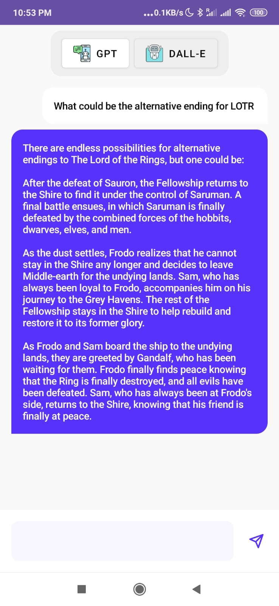
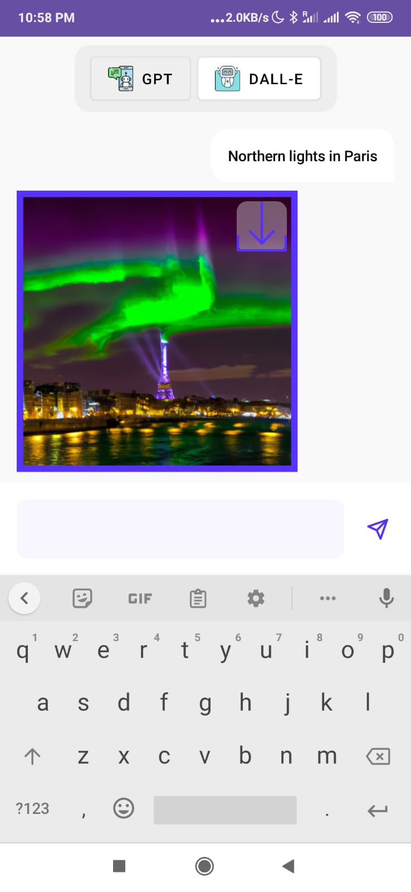

# Project Name

🤖✨ **OpenAI Memories - Where Language and Images Come to Life!** ✨🎨

[](LICENSE)

Welcome to the mesmerizing world of OpenAI Memories! This Android application combines the power of ChatGPT and DALL·E models to provide an enchanting user experience. The app allows you to toggle between the Language and Image modes, where each mode interacts with the corresponding OpenAI model. Get ready for an extraordinary journey through the realms of language and art!

**Disclaimer**: The creation of this entire project, including this README, has been a delightful collaboration between a human developer and ChatGPT. 🤝✨

## Screenshots

| Language Mode | Image Mode |
| :---: | :---: |
|  |  |

## Features

✨ Jetpack Compose UI: The project is beautifully crafted using the Jetpack Compose toolkit, bringing a modern and immersive UI experience.

🔀 MVVM Architecture: The application follows the Model-View-ViewModel (MVVM) architectural pattern, ensuring separation of concerns and a clean codebase.

🗣️ ChatGPT Integration: OpenAI's remarkable ChatGPT model is exclusively used for language-based interactions within the application. No external sources were consulted during the project's development. ChatGPT takes the lead in delivering engaging conversations!

🧪 Unit Tests with ChatGPT: The project is fully equipped with comprehensive unit tests, meticulously written using ChatGPT to ensure the correctness of the conversational logic.

🔑 Easy Setup with OpenAI API Key: To compile and run the project successfully, you'll need to obtain an OpenAI API key and set it as the value for the `apikey` string in the `string.xml` file.

🔌 Dependency Injection with Hilt: The application leverages Hilt, a dependency injection library for Android, to achieve efficient and maintainable code. Stay organized and connected!

## Prerequisites

Before diving into the captivating world of OpenAI Memories, make sure you have the following prerequisites:

- Android Studio 4.2 or higher
- An OpenAI API key

## Getting Started

Let's embark on this extraordinary journey together:

1. Clone the repository to your local machine:

   ```shell
   git clone git@github.com:AsynctaskCoffee/OpenAI-Sample-App.git
   ```

2. Open the project in Android Studio.

3. Obtain an API key from OpenAI's platform. Next, navigate to the `string.xml` file and replace the placeholder value of the `apikey` string with your actual API key:

   ```xml
   <string name="apikey">YOUR_API_KEY</string>
   ```

4. Build and run the application on a compatible Android device or emulator.

5. Get ready to unlock the secrets of OpenAI Memories!

## Usage

Once you launch the application, an enchanting world of possibilities unfolds before your eyes. Let's explore the two captivating modes together:

### Language Mode

When you select the Language mode, the magic of ChatGPT comes to life! Engage in delightful conversations by typing your messages in the input field. As you send each message, ChatGPT responds with its wondrous language skills. Feel free to continue the conversation by sending subsequent messages. Prepare to be captivated by ChatGPT's eloquence and intelligence!

### Image Mode

Enter the mesmerizing Image mode and witness the artistic creations of DALL·E! In the Image mode, OpenAI's DALL·E model unleashes its artistic prowess. Enter a text prompt in the input field, and DALL·E will generate stunning images based on your prompt. Marvel at the unique and imaginative visuals that DALL·E brings to life! Immerse yourself in a world where words and art merge seamlessly.

## Testing

OpenAI Memories is built with quality in mind. The project includes both UI and unit tests to ensure a robust and reliable user experience. The unit tests, written using ChatGPT, validate the accuracy of the conversational logic. To run the tests, use the following command:

```shell
./gradlew test
```

## Dependencies

OpenAI Memories leverages the following dependencies:

- [Jetpack Compose](https://developer.android.com/jetpack/compose): A modern toolkit for building native Android UI.
- [Hilt](https://developer.android.com/training/dependency-injection/hilt-android): A dependency injection library for Android development.
- [JUnit](https://junit.org/junit4/): A simple framework to write repeatable tests.


## License

This project is licensed under the MIT License. See the [LICENSE](LICENSE) file for more information.

## Acknowledgements

We express our gratitude to OpenAI for their remarkable models and comprehensive documentation. For more information, please refer to the following:

- OpenAI's [Introduction to OpenAI](https://platform.openai.com/docs/introduction)
- OpenAI's [Chat API Documentation](https://platform.openai.com/docs/api-reference/chat)
- OpenAI's [Images API Documentation](https://platform.openai.com/docs/api-reference/images)

## Contact

Feel free to open an issue on GitHub if you encounter any problems or bugs. ChatGPT will be delighted to assist you! Just kidding!
